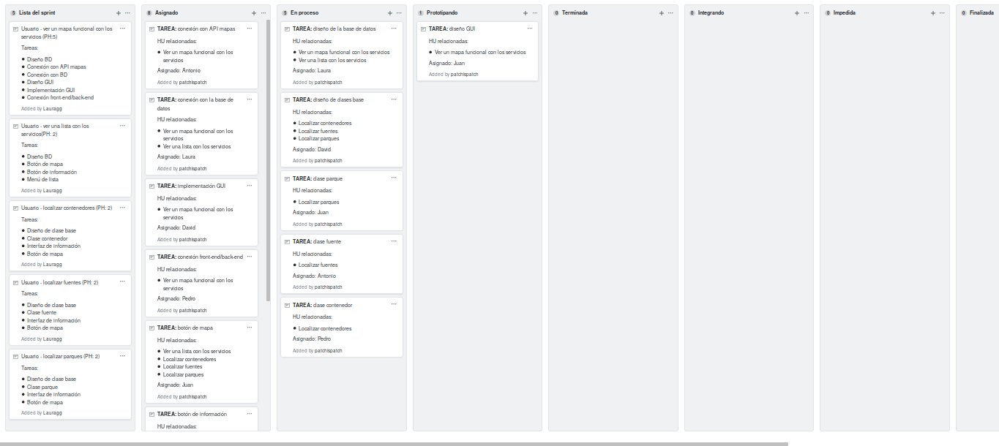

---
title: Tu ciudad
subtitle: Metodologías de Desarrollo Ágil
author:
- David Infante Casas
- Laura Gómez Garrido
- Pedro Bonilla Nadal
- Juan Ocaña Valenzuela
- Antonio Martín Ruiz
...

# División de tareas y asignación

## Primer Sprint

| Tarea | Historias Usuario | Asignado |
|:-------:|:------------:|:--------:|
|Diseño BD |HU1 HU8|Laura|
|Conexión con API mapas |HU1|Antonio|
|Conexión con BD|HU1| Laura|
|Diseño GUI|HU1|Juan|
|Implementación GUI|HU1|David|
|Conexión front-end/back-end|HU1|Pedro|
|Botón de mapa | HU8 HU9 HU3 HU4|Juan|
|Botón de información| HU8|Pedro|
|Menú de lista| HU8|Antonio|
|Diseño de clase base| HU9 HU3 HU4|David|
|Interfaz de información| HU9 HU3 HU4|Laura|
|Clase contenedor| HU9|Pedro|
|Clase fuente| HU3|Antonio|
|Clase parque| HU4|Juan|

## Segundo Sprint

| Tarea | Historias Usuario | Asignado |
|:-------:|:------------:|:--------:|
|Funciones de consulta| HU2 HU13|Juan|
|Botón y barra de búsqueda| HU2|Laura|
|Sugerencias de búsqueda| HU2|Pedro|
|Marcado de servicio en mapa| HU2|Antonio|
|Página de información|HU13|David|
|Botón mapa|HU13|Juan|
|Botón "no funciona" en información|HU14|Pedro|
|Formulario de incidencias|HU14|Antonio|
|Diseño de clases| HU11 HU10|David|
|Implementar diseño de clases| HU11 HU10|Laura|
|Función de borrar servicio en la BD| HU7|Laura|
|Botón borrar en información| HU7|Juan|
|Función de modificar servicio en la BD| HU6|Antonio|
|Botón modificar en información| HU6|Pedro|
|Formulario modificar| HU6|David|
|Función de crear servicio en la BD| HU5|Laura|
|Botón crear| HU5|Antonio|
|Formulario crear| HU5|Juan|

# Progreso del proyecto

