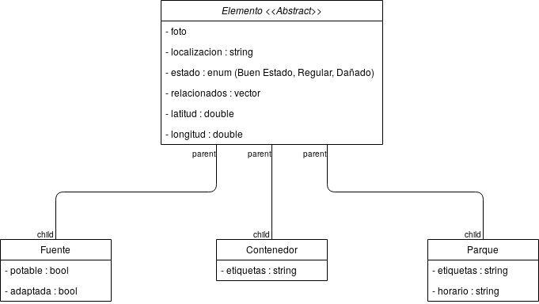
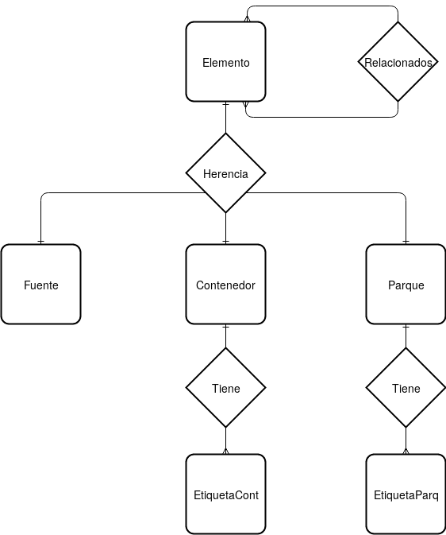

# Primer sprint

## Plan de Iteración
|                 | Día 1    | Día 2   | Día 3   | Día 4   | Día 5   | Día 6   |
|-----------------|----------|---------|---------|---------|---------|---------|
| David Infante   |Diseño de clases base|Diseño de clases base|Implementación GUI|Implementación GUI|Implementación GUI|Implementación GUI|
| Laura Gómez     |Diseño BD|Diseño BD|Conexión con la BD|Conexión con la BD|Conexión con la BD, Interfaz de información|Interfaz de información|
| Pedro Bonilla   |Clase contenedor|Clase contenedor|Conexión front-end/back-end|Conexión front-end/back-end|Conexión front-end/back-end, Botón de información|Botón de información|
| Juan Ocaña      |Clase parque, Diseño GUI|Clase parque, Diseño GUI|Botón de mapa|Botón de mapa|Botón de mapa|         |
| Antonio Martín  |Clase fuente|Clase fuente|Menú de lista|Menú de lista|Menú de lista, Conexión con API mapas|         |

## Sprint Review

Vamos empezar exponiendo las historias de usuario acabadas. Aquellas cosas que no debemos implementar en el contexto de las prácticas de la asignatura las consideraremos realizadas, por lo que en el contexto del Sprint Review se considerarán terminadas. Con esa consideración, los objetivos del sprint eran:

| ID   | Título                                            | PH   |
| ---- | ------------------------------------------------- | ---- |
| 1    | Usuario - ver un mapa funcional con los servicios | 5    |
| 8    | Usuario - ver una lista con los servicios         | 2    |
| 9    | Usuario - localizar contenedores                  | 2    |
| 3    | Usuario - localizar fuentes                       | 2    |
| 4    | Usuario - localizar parques                       | 2    |

A lo largo de este sprint hemos desarrollado los primeros pasos de la aplicación que han hecho que aumenten enormemente el valor del producto. No sólo hemos desarrollado un prototipo sino que también hemos diseñado cómo serían nuestras bases de datos, para estos diseños primero hemos necesitado pensar cómo serían las clases que formarían el esqueleto principal de nuestra aplicación, las cuales serían:

Y una vez diseñadas estas clases, hemos realizado el diseño de la base de datos:

En la demo realizado en clase se mostró cómo funcionaba nuestro prototipo y cómo habían sido cumplidos todos los objetivos. Al finalizar este documento, adjuntaremos un video dónde se podrá ver el correcto funcionamiento de estos objetivos junto a los del segundo sprint.

No hemos tenido muchos problemas para la realización del sprint. Por otro lado, al estar utilizando herramientas que eran desconocidas para nosotros teníamos problemas de cara a su uso y utilización más básico, el cual fue solventado observando los tutoriales que venían en la página web oficial y comprobando antes, fuera del prototipo, detalles para ver si cuadraban con lo que buscábamos o no.

Después del primer sprint tenemos un producto funcional hecho bajo la planificación y potencialmente comercializable. Por estos motivos, los stakeholders están muy contentos con el progreso y no consideran ninguna novedad de cara al desarrollo del producto estando satisfechos con el camino que este está siguiendo. Se planea seguir con el proyecto establecido.

## Sprint Restrospective
